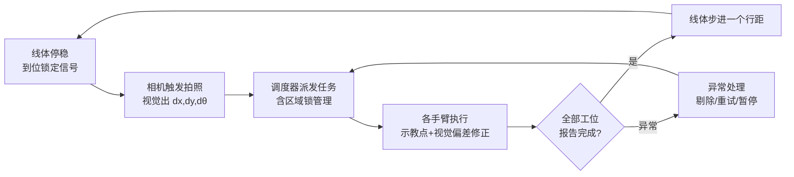

# 工位单元控制设计 —— 视觉引导取放 + 多机调度与防碰撞

- 版本：v0.1（设计 + 代码骨架）
- 日期：2026-07
- 上位文档：[`concept-design.md`](concept-design.md)（整线概念设计）
- 配套代码：[`/cellctl`](../cellctl/)（可运行骨架，含仿真驱动，无硬件也能跑通主循环）

本文档回答三个问题：

1. **视觉怎么做**——让程序"看得见"火腿/蛋皮这类不定形来料，做小偏差修正；
2. **多机怎么协同防碰撞**——用节拍时序 + 区域互锁，从设计上消灭碰撞，不做动态避障；
3. **放置怎么又顺又稳**——工作窗口逐格预演（离线排雷），每格独立接近姿态。

设计基调：**这是结构化产线问题，不是学习问题。** 位置由载具和节拍保证，
视觉只做毫米级修正；复杂度是敌人，凡是能用机械/布局/时序解决的，不上软件智能。

---

## 1. 总体架构：一个上位机状态机管全场



- **手臂端保持"傻"**：只接收一种指令——"去第 (r,c) 格，附加偏移 (dx, dy, dθ)"。
  所有智能（视觉、调度、互锁、异常处理）集中在上位机一个状态机里。
- 品牌差异封装在驱动层（UR=RTDE、节卡=官方 SDK、法奥=官方 SDK），
  上层只见统一的 `RobotArm` 接口——与概念设计 §6"统一工位任务协议"一致。
- 主状态机（每个步进节拍一圈）：

  | 状态 | 内容 | 出口条件 |
  |---|---|---|
  | `WAIT_LINE_LOCKED` | 等线体停稳+到位锁定 | PLC 到位信号 |
  | `CAPTURE` | 触发所有相机拍照、跑定位 | 全部视觉结果就绪（含"空格"结果） |
  | `DISPATCH` | 生成本节拍任务表，派发给各臂 | 任务全部下发 |
  | `EXECUTING` | 各臂并行执行，调度器只管锁和回执 | 全部完成回执 |
  | `ADVANCE` | 请求线体步进 | 步进完成信号 → 回到 `WAIT_LINE_LOCKED` |
  | `FAULT` | 任一环节超时/异常 | 人工复位或自动重试成功 |

---

## 2. 视觉方案：2D 定位 + 一次性手眼标定

### 2.1 为什么 2D 就够

火腿切完平躺在载具/托板上，**高度已知、姿态平躺**，
需要的只是平面内 **(x, y, θ)** 三个量，不需要 6D 位姿估计：

- 相机**固定装在输送线上方**（不装手臂上），手眼标定做一次就固定；
- 步进线走-停-走，**停稳瞬间触发拍照**，无运动模糊；
- 载具本身是定位基准，视觉只修正"料在载具里偏了多少"（±几 mm、±几度）。

放置端（吐司在载具里）位置由载具保证，**免视觉、用示教固定点**，
顶多加低成本相机做抽检确认（QC 门，见概念设计 §5.2）。

### 2.2 硬件与标定

| 项 | 选型 | 说明 |
|---|---|---|
| 取料定位相机 | 工业面阵相机 + 定焦镜头（海康机器人 SC 智能相机可一体化），或 RGB 相机 + 上位机 OpenCV | 每个视觉工位 1 台，俯视 |
| 打光 | 条形光/穹顶光 + 遮光罩 | **打光比算法重要十倍**：食品反光、颜色不均，隔掉环境光后算法难度降一个量级 |
| 标定板 | 棋盘格/ChArUco，食品级区域用后即撤 | |

标定两步（见 `cellctl/vision/calibration.py`）：

1. **相机内参 + 平面单应**：因为工作面是固定高度的平面，
   直接标 **像素 → 工作平面毫米坐标** 的单应矩阵 H（9 点标定即可），
   不必做完整 3D 内外参。
2. **手眼（相机→机器人基座）**：机器人夹标定针走 3–4 个点，
   同时记录像素坐标与机器人基座坐标，解 2D 刚体变换（平移+旋转+可选缩放）。
   结果存 `config/calibration/<station>.yaml`，换相机/撞了支架才需要重标。

### 2.3 定位算法（从简到繁，够用就停）

1. **首选：轮廓 + 最小外接矩形**（火腿这类外形规整的切片）：
   HSV/背景差分割 → 最大轮廓 → `minAreaRect` 得 (x, y, θ)。几十行 OpenCV。
2. 轮廓不稳时：**模板匹配**（旋转模板金字塔）或形状匹配。
3. 蛋皮这类边缘发虚的：分割网络（如轻量 U-Net）出掩膜再取矩形——二期再说。

输出统一为 `VisionResult{found, x_mm, y_mm, theta_deg, score}`，
score 低于阈值按"空格/来料异常"处理（跳过该格并记录，不猜）。

---

## 3. 多机防碰撞：三层递进，不做动态避障

> 判断标准：**如果发现需要"预测对方手臂在哪"，说明布局该改了，不是软件该更聪明。**

### 3.1 第一层：布局分离（最稳）

工位车布置时让相邻手臂的工作包络**尽量不重叠**。
各管各的区域，物理上碰不到，软件零成本。概念设计 §3.1 的工位间距按此原则定。

### 3.2 第二层：区域互锁 Zone Lock（重叠区兜底）

确实要共享的空间（如 S4 吐司臂与打酱头共用一行、S5 双料共用取料区），
把重叠区定义为**命名区域（zone）**，谁进谁先拿锁：

- 每个 zone 一把互斥锁，由调度器统一管理（`cellctl/scheduler/zone_lock.py`）；
- 手臂动作序列声明"本段轨迹要进哪些 zone"，**先拿到全部所需锁才开始动**，
  出区即释放（按序申请，天然无死锁——见代码中的排序申请策略）;
- 本质是几个布尔量，PLC 或上位机软件几行代码，传统产线几十年的成熟做法；
- 锁的申请/释放全部写日志，出问题可回放。

### 3.3 第三层：节拍时序（天然同步器）

步进线自带"全线停 → 各工位干活 → 全线走"的节奏。
把每台手臂动作安排在节拍内**固定时间窗**，时序上先错开，互锁只是兜底：

```
节拍 T ≈ 14 s（概念设计 §1.2）
  t=0.0s  线停稳，拍照（~0.5s）
  t=0.5s  各臂并行开工（各自窗口内 3~4 次取放）
  t=12.5s 全部回 HOME（HOME 位彼此不重叠，是各臂的"安全岛"）
  t=13.0s 线体步进
```

规则：**任何手臂在"线体运动"期间必须在自己的 HOME 安全岛内**——
这一条由调度器在 `ADVANCE` 前强制检查（所有臂已回 HOME 才发步进指令）。

---

## 4. 工作窗口逐格预演：放置又顺又稳

工作窗口 = 行 × 列 网格（概念设计为 3×3 九宫格；一行 4 载具时为 3×4=12 格，
**代码里行列数是配置项**，两种都支持）。靠边格子手腕容易别扭/近奇异点，
解法是**离线一次性排雷**，不在线算：

1. **每格独立示教**：全部格位预先示教/离线编程，每格单独定义
   **接近方向**（靠左的列从左上方切入、靠右的列从右上方切入），
   而不是所有格共用一个姿态。数据结构见 `config/grid_poses.yaml`：
   每格 = 放置位姿 + 接近位姿（approach）+ 退出位姿（retreat）+ 所属 zone 列表。
2. **仿真先验证**：法奥/节卡/UR 都有官方离线仿真，或用 RoboDK（三牌全支持）
   把工位摆进去，逐格检查可达性、关节角裕量、奇异点。
   **基座装哪、装多高在仿真里定，别在现场试**——基座位置对"顺不顺"的影响
   大于任何软件优化。
3. **转弯区 blend**：路径点间圆滑过渡不停顿（UR blend radius，节卡/法奥有对应参数，
   驱动层统一暴露为 `blend_mm`），取放节拍可省 20–30%。
4. **固定扫描顺序**：蛇形或按列扫，减少大幅重新定向；顺序写在配置里，可调不重编程。

视觉偏差的用法：**只加在"取料点"上**（料的位置不定），
放置点是载具定位的示教点，不加视觉偏差（`place = taught_pose` 即可）。

---

## 5. 代码骨架说明（`/cellctl`）

```
cellctl/
├── config/
│   ├── line.yaml            # 线体/工位/手臂/zone 配置（行列数在这里改）
│   └── grid_poses.yaml      # 网格放置点规范：每格位姿+接近/退出+zone
├── robots/
│   ├── base.py              # RobotArm 抽象接口（三牌统一）
│   ├── ur_driver.py         # UR：RTDE（ur_rtde 库）—— 骨架
│   ├── jaka_driver.py       # 节卡：官方 Python SDK —— 骨架
│   ├── fairino_driver.py    # 法奥：官方 Python SDK —— 骨架
│   └── sim_driver.py        # 仿真驱动：无硬件跑通全流程/测互锁
├── vision/
│   ├── calibration.py       # 平面单应 + 2D 手眼标定（可独立运行）
│   └── locator.py           # 轮廓法定位 → VisionResult(dx,dy,dθ)
├── scheduler/
│   ├── zone_lock.py         # 区域互锁（排序申请防死锁 + 日志）
│   ├── dispatcher.py        # 任务生成与派发（网格→任务表）
│   └── state_machine.py     # 主状态机（§1 的六个状态）
└── main.py                  # 入口：加载配置→仿真跑 N 个节拍
```

无硬件即可验证：`python -m cellctl.main --cycles 3`
（全部用 SimDriver + 假视觉，重点看状态流转、互锁日志、回 HOME 检查）。

接真机的顺序建议：

| 步骤 | 内容 | 改动点 |
|---|---|---|
| 1 | 单臂（建议 UR，接口最省事）+ 固定点取放，无视觉 | `line.yaml` 里该臂 driver 换 `ur` |
| 2 | 加相机：标定 → 视觉偏差修正取料 | 跑 `calibration.py`，locator 阈值调参 |
| 3 | 第二台臂 + 一个共享 zone，验证互锁 | 配置加 zone，观察锁日志 |
| 4 | 接 PLC 到位/步进信号，替换模拟线体 | `state_machine.py` 的 LineIO 实现 |

## 6. 待验证项

1. 火腿轮廓分割在实际光照/油面反光下的稳定性（决定要不要上打光罩等级）。
2. 三牌驱动的 blend 参数语义差异（UR 是半径，节卡/法奥需实测行为）。
3. 节拍内时间窗余量：单臂一行 3–4 格实测时间 vs 12 s 预算。
4. zone 粒度：过粗会让并行度下降（互相等锁），过细管理复杂——从"每工位 1–2 个"起步。
