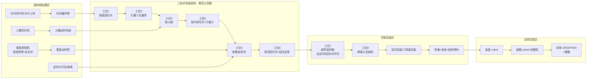
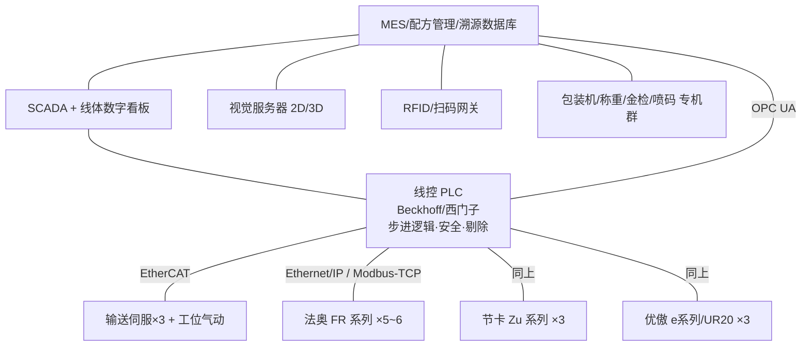

# 协作机器人三明治柔性生产线 —— 概念设计书

- 版本：v0.1（概念阶段）
- 日期：2026-07
- 机器人品牌：法奥 Fairino（FR 系列）、节卡 JAKA（Zu/Pro 系列）、优傲 UR（e 系列 / UR20）
- 产品对象：三片吐司三明治（吐司 × 3，中间两层夹料：火腿 / 蛋皮 / 起司片，
  配美乃滋等酱料），成品对半切、去边去耳朵，单包装 → 装盒 → 装箱 → 码垛
- 硬性要求：**柔性生产线**（多 SKU 快速换产）

---

## 1. 总体概念

### 1.1 核心矛盾与对策

协作机器人（cobot）的优势是安全（可免围栏协作）、部署快、易示教、占地小；
劣势是速度慢——单次取放通常 3–5 s，远不如 Delta 高速分拣机器人（<1 s）。
做食品产线，直接的对策不是让 cobot 跑快（食品抓取本身也不允许高加速度甩料），
而是**用并行度换节拍**：

1. **三条轨道并行**：一个步进周期同时推进 3 份三明治。
2. **一次做一行**：每个工位面前是 3 行 × 3 列的九宫格窗口，
   机器人完成面前一"行"（横跨 3 条轨道的 3 格），线体步进一个行距。
3. **窗口有 3 行深度**：一个载具从进入某工位窗口到离开，要经历 3 个步进节拍。
   这意味着任何一个工位的实际可用作业时间是 3 × 节拍时间——
   慢工序（比如要配合切火腿机出料节奏的工位）可以"跨行补作业"，
   或在同一窗口内布置双臂分担，不会卡死整线节拍。

### 1.2 节拍与产能估算

设定单臂一次取放（含定位、开合爪）按保守值 4 s 计：

| 参数 | 数值 | 说明 |
|---|---|---|
| 单臂完成一行 3 格 | 3 × 4 s = 12 s | 同类物料连续取放，路径短 |
| 线体步进（一个行距） | ≈ 2 s | 伺服步进，含到位锁定 |
| **步进节拍 T** | **≈ 14–15 s** | 取瓶颈工位 |
| 每节拍产出 | 3 份（3 条轨道各 1 份） | |
| **理论产能** | **≈ 720 份/小时** | 3600 / 15 × 3 |
| 按 OEE 80% 计 | **≈ 570–600 份/小时** | 设计目标 ≥ 600 份/h 时可把节拍压到 13 s 或关键工位双臂化 |

> 平衡原则：任何工位单臂作业时间 > 12 s 的，要么"机器做、机器人只搬"
> （例如打酱交给定量泵，而不是机器人挤酱），要么在窗口内加第二只手臂，
> 要么利用 3 行深度跨节拍作业。

### 1.3 整线流程图



---

## 2. 输送线与载具设计（柔性的机械基础）

### 2.1 三轨步进输送线

- **形式**：3 条平行伺服步进链/带（也可用一条宽带分 3 道），行距 = 载具长度 + 间隙。
  推荐每条轨道独立伺服驱动——这是"柔性"的关键之一：
  **三条轨道可以跑三个不同 SKU**（不同配方在 MES 里按轨道号下发），
  也可以同 SKU 三倍产能。
- **步进逻辑**：所有工位完成信号（AND）→ 线体前进一个行距 → 到位锁定 → 下发新一行任务。
  瓶颈工位决定节拍；MES 实时显示各工位作业时间热力图，指导线平衡。
- **升级路径**：预算允许时用**磁驱环形输送（如 Beckhoff XTS / 磁悬浮 mover）**替代
  固定步进链——每个载具独立控速，可以在慢工位前自动排队、快工位后加速追赶，
  柔性和线平衡能力再上一个台阶。概念阶段先按伺服步进链设计，接口留好。

### 2.2 载具（定位模盒）——本设计的"灵魂零件"

三明治全程不直接放在皮带上，而是放在**食品级定位模盒**里：

- 材质 PP/POM 食品级，内腔按吐司外形倒角定位（±1 mm），
  **通用内腔 + 可换内衬**适配不同吐司尺寸（柔性）。
- 底部嵌 **RFID 标签**（或侧面激光二维码），是全程溯源的物理载体。
- 载具是机器人的**定位基准**：只要载具到位锁定，取放点就是确定的，
  常规工位不需要视觉也能盲放，省钱又稳定；视觉只用在来料不定形的地方（蛋皮、火腿）。
- 切割工位的载具内腔兼作**切割定位槽**，底部开刀缝。
- 空载具在线尾洗净、烘干、回流（下层返回输送带），形成闭环。

---

## 3. 工位详细设计

### 3.0 原料预处理区（机器做加工，机器人做衔接）

原则：**切、煎、挤这类"加工"交给专机；协作机器人只负责"搬运与放置"。**
这样每台专机独立成模块，坏了、换了不影响别家。

| 模块 | 设备 | 与机器人的接口 |
|---|---|---|
| 吐司分片上料 | 吐司切片机 + 分片吸取塔（或人工整包上料 + 自动推片） | 出料位固定，法奥 FR5 直接吸取 |
| 火腿切片 | 商用火腿切片机（伺服定厚，可按配方调厚度） | 切好的火腿片落在出料托板，节卡 + 2D 视觉抓取 |
| 蛋皮煎制 | 连续蛋皮机（浆料泵 + 转鼓/链板煎烤 + 定长切断） | 蛋皮软、易破：节卡 + 柔性夹爪或大面积透气真空吸盘 |
| 起司片供给 | 起司片自动剥离机（撕隔膜、单片供给） | 出料位固定，盲取 |
| 酱料供给 | 保温酱料桶 + 螺杆/活塞定量泵，管路到打酱工位 | 无机器人，纯设备 |

### 3.1 组装区工位（S1–S6）

每个工位 = 1 台协作机器人 + 快换末端 + 面前 3×3 载具窗口。

| 工位 | 动作 | 机器人 | 末端执行器 | 要点 |
|---|---|---|---|---|
| S1 | 从缓存塔取底层吐司放入载具 | 法奥 FR5 | 波纹真空吸盘×4 | 吸附面大、低真空防压痕 |
| S2 | 打酱①（美乃滋等） | **无机器人** | 三头定量泵 + Z 轴 | 一次给一行 3 格同时打酱，<3 s；酱量/图案（点/Z 字/螺旋）由配方控制 |
| S3 | 放火腿（1–2 片按配方） | 节卡 Zu7 + 2D 视觉 | 柔性夹爪或针式抓手 | 视觉定位切片机出料托板上的火腿位姿 |
| S4 | 放中层吐司 + 打酱② | 法奥 FR5（吐司）+ 定量泵（酱） | 真空吸盘 | 打酱头装在工位框架上，机器人放完即打 |
| S5 | 放蛋皮 / 起司片（按配方二选一或都放） | 节卡 Zu7 + 视觉 | 大面积透气真空吸盘（蛋皮）/ 普通吸盘（起司） | **柔性关键位**：同一工位靠换程序+换吸具支持不同夹料 |
| S6 | 放顶层吐司 + 轻压定型 | 法奥 FR5 | 吸盘 + 气动压板 | 压力可调（配方参数），压实利于切割 |

> 换 SKU 示例——"起司蛋三明治"：S3 火腿工位在配方里被跳过（该工位机器人待机
> 或临时改做别的料），S5 放蛋皮+起司两次取放（利用 3 行窗口余量），其余不变。
> **不动硬件，只动配方。**

### 3.2 切割工位（S7）：去边、切耳朵、对半切

- **工艺选型：超声波切刀**。冷压后的多层三明治用普通刀切会压塌、粘刀；
  超声波刀（20/30 kHz）切口干净、不粘酱料，是行业标准做法。
- **实现方式**：优傲 UR10e 持超声波刀，按配方轨迹切：
  1. 四边去边（切耳朵）——四条直线；
  2. 对角切或对半切（配方参数：对角△ / 直切▯ / 四分）。
- 载具内腔就是切割定位槽，底部留刀缝；切边废料由载具边上的负压吸口/落料槽收集，
  统一送料头回收。
- **为什么用机器人持刀而不是专用切割龙门**：轨迹即程序，换切法零换模——柔性。
- **安全注意**：刀具工位不适用"协作免围栏"逻辑（ISO/TS 15066 不覆盖刀刃风险），
  此工位加透明安全罩 + 安全门锁，cobot 在罩内仍保留易编程优势。
- 节拍：6 条切割线约 8–10 s/份 → 一行 3 份约 30 s > 节拍，
  故此工位**上双臂**（两台 UR10e 分担一行）或做成 2 个串联切割工位各切一半轨迹。
  概念阶段按双臂设计。

### 3.3 一次包装（S8–S10）

| 工位 | 内容 | 设备/机器人 |
|---|---|---|
| S8 | 把切好的两半从载具移入包装机入料链 | 法奥 FR5，L 形铲式端拾器（半个三明治从侧面铲起，不夹压切面） |
| S9 | 单包装：枕式包装机（flow-pack，充氮气调可选）；三角袋 SKU 用三角包装机——**两台包装机并排，MES 按 SKU 把 S8 的放料目标切到对应入料链** | 专机 |
| S10 | 在线称重（剔除缺料）→ 金属检测 → TTO 热转印/激光喷码（生产日期、批号、**GS1 DataMatrix 单品码**）→ 贴标 | 专机 |

### 3.4 后段包装（S11–S13）

| 工位 | 内容 | 机器人 | 说明 |
|---|---|---|---|
| S11 装盒 | 按 SKU 把 N 包装入展示盒/餐盒 | 法奥 FR10 | 视觉确认包装袋位姿；盒由开盒机供给；装满扫码聚合 |
| S12 装箱 | 盒装入瓦楞箱，封箱机封箱，贴**箱标（GS1-128）** | 节卡 Zu12 | 排列方式=配方参数 |
| S13 码垛 | 箱码垛成垛，贴**垛标（SSCC）**，缠膜机缠膜 | **优傲 UR20（20 kg）或法奥 FR20** | 协作码垛工作站占地小，可免围栏（限速+区域扫描仪） |

---

## 4. 柔性如何落地（本设计的重点）

"柔性"不是口号，落到五个具体机制：

1. **配方驱动（Recipe-Driven）**
   MES 中每个 SKU = 一张配方表：层序（哪层放什么）、酱量与图案、火腿厚度/片数、
   切割轨迹、包装形式、装盒数、垛型。换产 = 下发配方，目标换产时间 < 10 分钟
   （不换硬件时 < 1 分钟）。
2. **三轨道即三条虚拟产线**
   每条轨道可绑定不同配方（载具 RFID 决定它是谁），小批量多品种时
   一条线同时出 3 个 SKU；大单品时三轨同配方拉满产能。
3. **模块化工位小车（Plug-and-Produce）**
   每个工位（机器人底座 + 末端库 + 局部供料器）装在带脚轮+定位销的标准小车上，
   与线体的接口统一为：机械定位销 ×2 + 一个 Harting 组合插头（动力/气/网）
   + OPC UA 身份握手。增删/调换工位 = 推走一台车、推来一台车，
   MES 自动发现新模块并重排任务。产品从三明治换成贝果/卷饼时，
   换的是工位车组合，线体不动。
4. **快换末端执行器**
   所有 cobot 配气动快换盘（ATI/Schunk 级），末端库放在工位车上：
   真空吸盘、柔性夹爪、针式抓手、铲式端拾器、超声波刀。配方切换时机器人自己换手。
5. **免专机化的关键决策**
   凡"轨迹类"工序（切割、打酱图案、码垛垛型）都用"机器人/伺服 + 程序"实现
   而非机械凸轮/模具，改程序即改产品。

---

## 5. 溯源与追踪体系

### 5.1 五级聚合模型（对齐 GS1）

```
原料批次 ──绑定──▶ 三明治(载具RFID→单品DataMatrix)
                     └─N包──▶ 盒(盒码) ─M盒──▶ 箱(GS1-128/SSCC箱码) ─K箱──▶ 垛(SSCC垛标)
```

- **上料绑定**：火腿、吐司、蛋液、酱料上线时扫原料批次码，MES 把
  "该批次 → 时间窗口 → 轨道号"写入；从此每个经过的载具自动继承原料批次。
- **过程数据挂载**：每个载具每过一个工位，记录：时间戳、工位号、机器人程序版本、
  关键参数（酱量实测、压型压力、切割功率曲线）、视觉 QC 图片、称重值、金检结果。
- **单品码**：S10 喷印 GS1 DataMatrix（含 GTIN + 批号 + 生产日期 + 序列号），
  与载具 RFID 在喷码瞬间"过户"——载具回流，数据跟着单品码走。
- **逐层聚合**：装盒/装箱/码垛工位各配固定式扫码器，机器人每放一件扫一件，
  MES 生成父子关系（parent-child aggregation）。召回时反向查询：
  垛 → 箱 → 盒 → 单品 → 原料批次，分钟级定位。
- **消费端**：单品码可映射到 C 端追溯页（产地、批次、生产视频快照可选）。

### 5.2 质量门（QC Gates）

| 位置 | 检测 | 不合格处理 |
|---|---|---|
| S3/S5 后 | 2D 视觉：夹料有无/偏移 | 标记载具，S6 前机器人剔到返工道 |
| S6 后 | 3D 轮廓（激光线）：总高度=层数正确 | 同上 |
| S10 | 称重（±g 级）+ 金检 | 气动剔除到锁定箱，MES 记录 |

---

## 6. 控制与软件架构



- 三个品牌的 cobot 全部支持 Modbus TCP / Ethernet-IP / socket 接口，
  **统一由线控 PLC 用同一套"工位任务协议"调度**（任务号、行号、配方参数、完成/异常回执），
  品牌差异封装在各自的驱动层——以后换第四个品牌也不动上层。
- 数字孪生（可选二期）：用 RoboDK / Process Simulate 做离线编程与节拍仿真，
  新配方先在孪生里验证再下线。

---

## 7. 卫生与安全设计

- **食品接触**：末端执行器与载具用食品级材料（FDA/EU 10-2011），
  机器人用 NSF H1 食品级润滑脂型号；组装区机器人建议选 IP54 以上
  （节卡 Zu 系列原生 IP54；法奥/优傲加防护服），线体不锈钢 304、可水冲设计（IP65 区域划分）。
- **协作安全分区**：
  - 组装/装盒/装箱/码垛：限功率+限速 + 区域激光扫描仪减速，免硬围栏（依 ISO 10218 / TS 15066 做风险评估）；
  - 切割（超声波刀）、火腿切片机、封箱机：**物理防护罩 + 安全门锁**——有刀刃/夹点的一律不裸奔。
- **异物管控**：紧固件防松点胶蓝色可视化、金检 + 称重双保险、刀具计数管理。

---

## 8. 机器人配置清单（概念）

| 区域 | 数量 | 型号建议 | 任务 |
|---|---|---|---|
| 组装 S1/S4/S6 | 3 | 法奥 FR5 | 吐司取放、压型 |
| 组装 S3/S5 | 2 | 节卡 Zu7 + 2D 视觉 | 火腿、蛋皮/起司（不定形物料） |
| 切割 S7 | 2 | 优傲 UR10e + 超声波刀 | 去边、切耳、对半切 |
| 移载 S8 | 1 | 法奥 FR5 | 入包装机 |
| 装盒 S11 | 1 | 法奥 FR10 | 装盒 |
| 装箱 S12 | 1 | 节卡 Zu12 | 装箱 |
| 码垛 S13 | 1 | 优傲 UR20（或法奥 FR20） | 码垛 |
| **合计** | **11** | | |

> 品牌分工逻辑：UR 打"关键工艺+高负载"（贵但稳），节卡打"视觉引导+IP54 湿区"，
> 法奥打"大数量常规取放"（性价比摊薄成本）。三品牌统一任务协议，互为备份供应链。

---

## 9. 分期实施建议

| 阶段 | 范围 | 里程碑 |
|---|---|---|
| 一期 | 三轨步进线 + 载具 + S1–S6 组装 + 超声切割 + 人工辅助包装 | 打通节拍，验证 600 份/h |
| 二期 | 枕式包装 + 称重金检喷码 + 装盒装箱 + 单品溯源 | 无人化到箱级 |
| 三期 | 码垛缠膜 + 五级聚合溯源 + 数字孪生离线编程 | 全线无人 + 分钟级召回 |

## 10. 风险与待验证项（下一步工作）

1. **蛋皮抓取良率**：透气大面积吸盘 vs 针式 vs 铲式，需打样测试（最高风险项）。
2. **切割节拍实测**：超声刀 6 线切割实际用时，决定 S7 单臂/双臂。
3. **酱料在低温环境的流变**：定量泵选型（螺杆 vs 活塞）需按酱料黏度试验。
4. **载具回流洗烘节拍**：载具总数 = 在线数 × 1.5 冗余，洗烘线能力要匹配。
5. **三轨异 SKU 时包装机切换**：flow-pack 换膜卷不可能分钟级，异 SKU 并产时
   建议"同包材不同内容"先行（膜通用、标签区分）。
